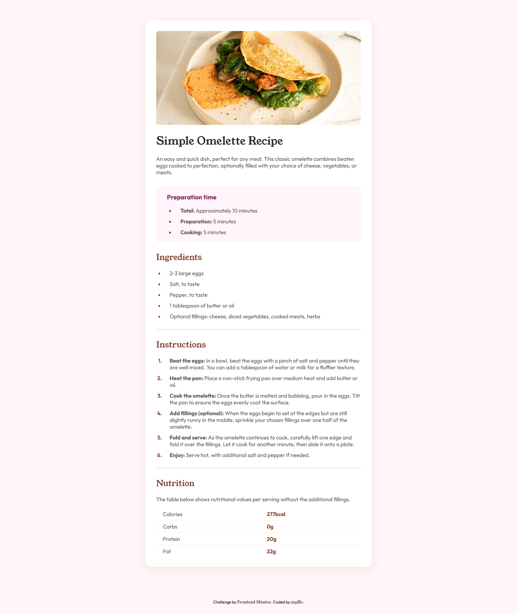

# Frontend Mentor - Recipe page solution

This is a solution to the [Recipe page challenge on Frontend Mentor](https://www.frontendmentor.io/challenges/recipe-page-KiTsR8QQKm). Frontend Mentor challenges help you improve your coding skills by building realistic projects. 

## Table of contents

- [Overview](#overview)
  - [Screenshot](#screenshot)
  - [Links](#links)
- [My process](#my-process)
  - [Built with](#built-with)
  - [What I learned](#what-i-learned)
  - [Continued development](#continued-development)
  - [Useful resources](#useful-resources)
- [Author](#author)


## Overview

### Screenshot




### Links

- Solution URL: [My solution here!](https://mpflo.github.io/recipe-page-main/)

## My process

### Built with

- Semantic HTML5 markup
- SCSS
- Flexbox
- Mobile-first workflow

### What I learned

In this project, I was able to practice using SCSS, from the use of syntax to extremely interesting properties like mixin, which creates a kind of function in our style sheet.

```css
footer {
      margin: 36px 28px 28px;  
      font-size: 12px;
      text-align: center;

      a {
          font-family: 'Young Serif';
          text-decoration: none;
          color: $stone-600;

          &:hover {
              color: $stone-900;
          }
      }
  }
```

For the SCSS compilation, I used a extension called **Live Sass Compiler** by **Glenn Marks** and I also left the CSS code minified.

Another thing I was finally able to practice was the use of variable fonts in the code. Until then, I had been using static fonts, mostly because I was comfortable using the same type of font, but this time I wanted to learn this new way and I really liked it.
I consider it more practical to use because you don't need countless font files and the transition between font styles is more fluid.

### Continued development

I will use more variable fonts to explore the possibilities of use, as well as continue training with SCSS.


### Useful resources

- [Convert variable font TTF to WOFF2](https://webfont.yabe.land/en/misc/convert-ttf-woff2/?source=post_page-----3a89da8d3b04--------------------------------) - Very important source to convert the variable font from TTF to WOFF2, since our variable font needs to be of the WOFF2 type so that it can work in our project.

## Author

- GitHub - [@mpflo](https://github.com/mpflo)
- Frontend Mentor - [@mpflo](https://www.frontendmentor.io/profile/mpflo)
